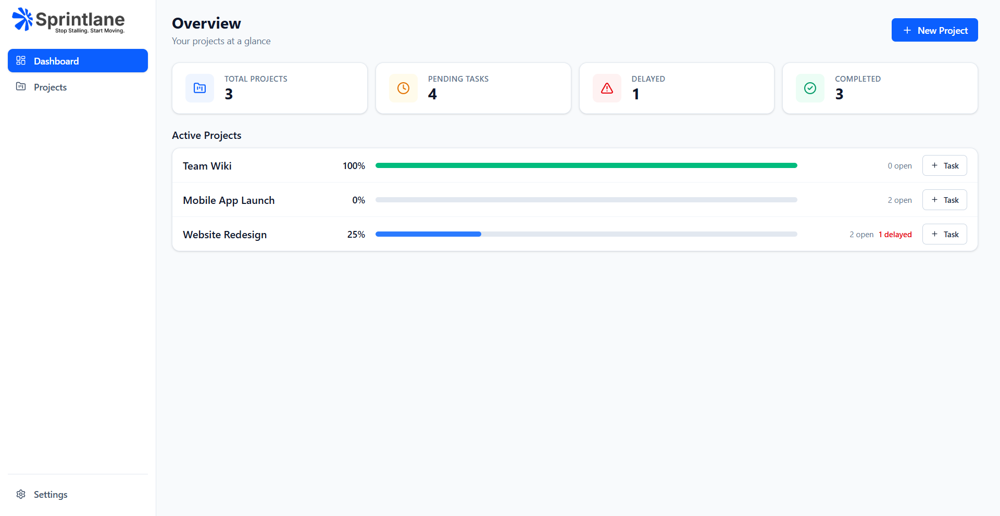
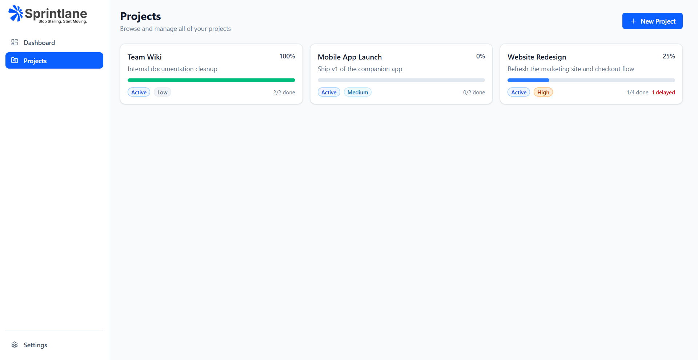
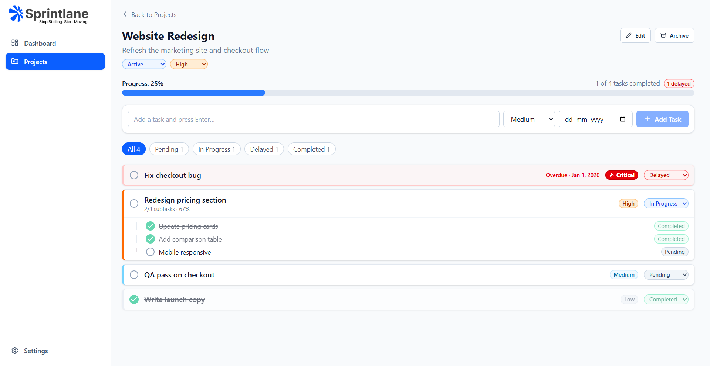
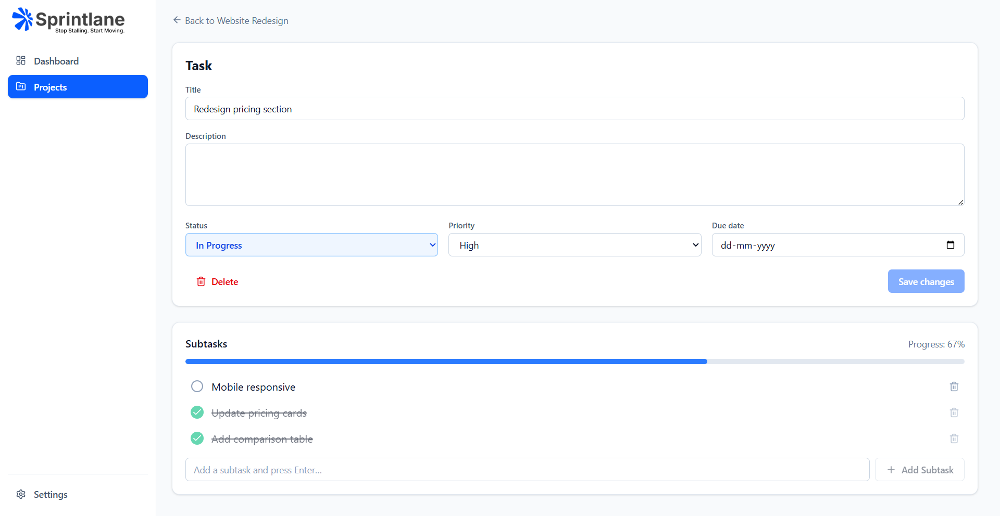
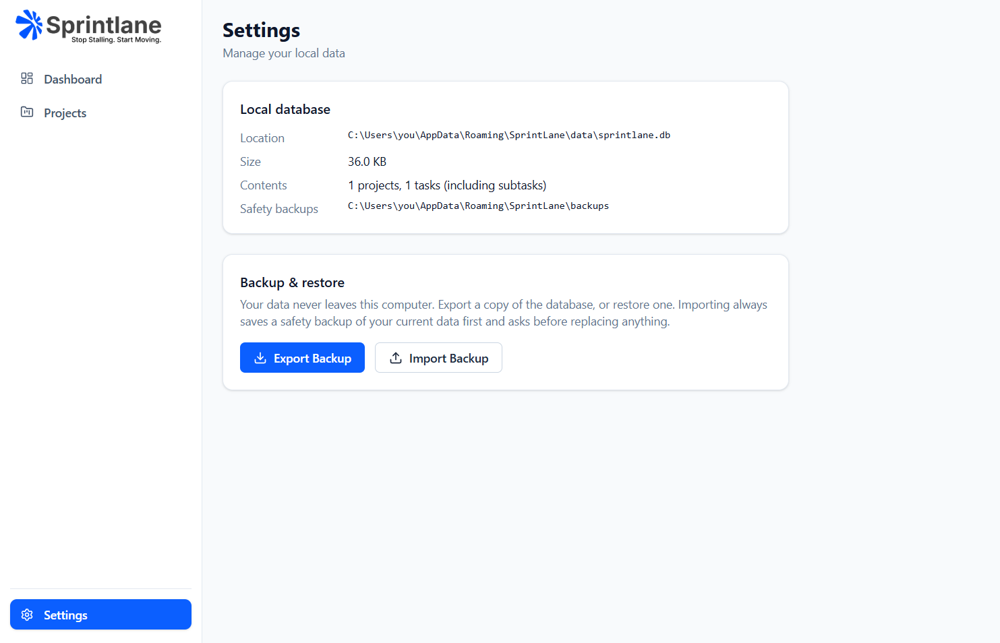

# SprintLane

**Stop Stalling. Start Moving.**

SprintLane is a local-first Windows desktop app for tracking projects, tasks and subtasks — priorities, due dates,
progress and delayed work — with everything stored in a local SQLite file. No account, no server, no internet
connection required.

Built with Electron, React, TypeScript, Tailwind CSS and Drizzle ORM. See
[`SprintLane_Build_Specification_v1.0.0.docx`](SprintLane_Build_Specification_v1.0.0.docx) for the full product spec this
implements.

> Screenshots below use placeholder example data ("Website Redesign", "Mobile App Launch", "Team Wiki") — not real
> project data.

## Screenshots

| Dashboard | Projects |
| --- | --- |
|  |  |

| Project detail | Task detail |
| --- | --- |
|  |  |

| Settings |
| --- |
|  |

## Features

- **Projects** — create, edit, archive, set status (Active / Completed / Archived) and priority.
- **Tasks** — title, description, status (Pending / In Progress / Completed / Delayed), priority (Low / Medium / High /
  Critical), due date.
- **Subtasks** — one level of children per task, completed independently.
- **Automatic progress** — task and project completion percentages recalculate as work changes; overdue open tasks
  are automatically marked Delayed.
- **Dashboard** — total projects, pending/delayed/completed counts, and progress across active projects at a glance.
- **Filtering** — All / Pending / In Progress / Delayed / Completed, per project.
- **Backup & restore** — export a database snapshot, import one back with validation and an automatic safety backup
  before anything is replaced.
- **Local-first** — all data lives in a SQLite file in your Windows user profile; nothing leaves the machine.

## Getting started

Requirements: Node.js 20+ and npm on Windows.

```bash
npm install
npm run dev
```

This starts Vite and launches the Electron window with hot reload.

### Other commands

| Command | What it does |
| --- | --- |
| `npm run dev` | Vite dev server + Electron with hot reload |
| `npm run build` | Typecheck and build renderer + main/preload |
| `npm start` | Run the built app (`npm run build` first) |
| `npm test` | Unit + database integration tests |
| `npm run typecheck` | Type-check only, no build |
| `npm run db:generate` | Generate a SQL migration after editing `electron/database/schema.ts` |
| `npm run dist` | Build the Windows installer into `release/` |

## Project structure

```
sprintlane/
├── electron/               # Main process (never rendered, no DOM)
│   ├── main.ts              # App lifecycle, window creation, wires everything up
│   ├── preload.ts           # Narrow, typed contextBridge API exposed to the renderer
│   ├── database/
│   │   ├── client.ts         # Opens the SQLite file, runs migrations, validates backups
│   │   ├── schema.ts         # Drizzle table definitions (source of truth for the schema)
│   │   ├── projectRepo.ts    # Project CRUD + stats
│   │   ├── taskRepo.ts       # Task/subtask CRUD, progress and overdue rules
│   │   └── migrations/       # Generated SQL migrations (npm run db:generate)
│   └── ipc/                 # ipcMain.handle registrations per domain
├── src/                     # Renderer (React) — never touches SQLite directly
│   ├── app/routes/           # Route table
│   ├── features/             # dashboard/, projects/, tasks/, settings/
│   ├── components/           # ui/ (buttons, fields, dialogs) and layout/ (shell, page header)
│   └── lib/                  # zustand store, utils
├── shared/                  # Used by both renderer and main
│   ├── types.ts               # Domain types + zod validation schemas
│   └── progress.ts            # Progress-percentage rules (unit tested)
└── docs/screenshots/         # README images
```

## Architecture

- **Renderer** (`src/`) never touches SQLite — it only calls `window.sprintlane`, the API exposed by the preload
  script.
- **Preload** (`electron/preload.ts`) exposes a narrow, typed IPC surface (`projects:*`, `tasks:*`, `backup:*`) via
  `contextBridge`. `contextIsolation` is on and `nodeIntegration` is off.
- **Main** (`electron/`) owns the database: IPC handlers, repositories, Drizzle schema, migrations, backup/restore.
- **Shared** (`shared/`) holds the zod schemas, types and progress rules used by both sides, so validation and
  progress math can't drift between the UI and the database layer.

### Database

SQLite via Node's built-in `node:sqlite` (bundled with Electron), driven through Drizzle ORM's `sqlite-proxy` driver.
This avoids native modules entirely, so no Python or Visual Studio build tools are required to install or build the
project. Migrations are plain SQL files in `electron/database/migrations`, bundled into the main process and tracked
in a `__migrations` table so they only ever run once.

The database lives at `%APPDATA%\SprintLane\data\sprintlane.db` (resolved through Electron's `app.getPath`, never
hard-coded), outside the install directory — so app updates and uninstalls never touch user data.

### Behaviour worth knowing

- **Progress** — a task with no subtasks is 0% or 100%; with subtasks, it's completed/total. A project's progress is
  completed **top-level** tasks / total top-level tasks (subtasks never double-count).
- **Delayed tasks** — any open task past its due date is automatically marked Delayed; moving the due date forward
  un-delays it.
- **Parent/subtask sync** — completing every subtask completes the parent; reopening any subtask reopens the parent;
  completing a parent completes all of its subtasks.
- **Backup** — export uses `VACUUM INTO` for a consistent single-file snapshot. Import validates the selected file
  first (SQLite header, integrity check, expected tables, not from a newer app version), asks for confirmation,
  writes a safety backup to `%APPDATA%\SprintLane\backups`, then swaps the database — rolling back automatically if
  anything fails.

## Testing

```bash
npm test
```

Covers the progress-percentage rules (`shared/progress.test.ts`) and the repositories end-to-end against a real
temporary SQLite file (`electron/database/repo.test.ts`): persistence across reopen, subtask/parent sync, cascade
delete, the overdue rule and backup-file validation.

## License

[MIT](LICENSE) © Chandan Kumar Pradhan
